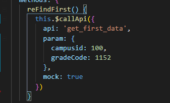
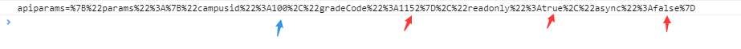
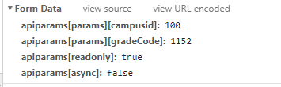
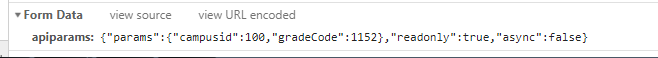
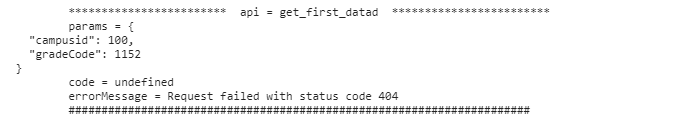

## 引入

在 src 目录中创建 resource 目录，创建 api.js 文件用来封装 axios

```
import axios from 'axios';
import qs from 'qs'; // 用来序列化post类型的数据
```

## 运行环境

```
- axios.defaults.baseURL = `${window.location.origin}/api/pc/`
```

- baseURl 当 url 为相对路径的情况下,url 将拼接在 baseURl 所以 axios 实例可以避免先重复的 baseURl 部分。
  window.location.origin 获取到当前环境 ('/'前面的 url)当前环境可能为本地,测试,demo,正式环境这样可以动态匹配对应的 baseURL

## 设置通用配置 (本文中以 post 请求方法为例)

```
axios.defaults.headers.post['Content-Type'] =
  'application/x-www-form-urlencoded; charset=UTF-8'
axios.defaults.timeout = 50000
```

- 当前请求方式为 post 方式，需要设置请求头 统一采用 application/x-www-form-urlencoded 格式

* 设置请求超时时间为 5s

## 定义 callApi 方法

```
const callApi = ({
  api,
  param,
  readonly = true,
  axiosOptions = {},
  error = '调用接口失败',
  success = '',
  async = false,
  mock = false
}) => {
  if (mock) {
    axiosOptions = Object.assign(axiosOptions, {
      baseURL: 'https://easy-mock.com/mock/5bc94237364160152beb30e7/'
    })
  }
}
```

这里 callApi 就是封装的 axios 方法，首先看方法的入参，默认接受一个对象，通过`对象的结构赋值`的方式取值，api 和 baseURL 组成完整的 url，param 是请求参数，readonly 是否为只读(当接口为查询时设置为 true，修改保存设置为 false)，并且参数`可以设置默认值`，如后四个参数都设置了默认值，mock 表示`是否开启mock数据` 如果传入 mock 为真则重新设置 baseURL 并且将 option`合并到配置对象axiosOptions`上用于后面生成 axios 实例

```
const callApi = ({
  api,
  param,
  readonly = true,
  axiosOptions = {},
  error = '调用接口失败',
  success = '',
  async = false,
  mock = false
}) => {
  if (mock) {
    axiosOptions = Object.assign(axiosOptions, {
      baseURL: 'https://easy-mock.com/mock/5bc94237364160152beb30e7/'
    })
  }
  const axiosInstance = axios.create(axiosOptions)
  const params = qs.stringify({
    apiparams: JSON.stringify({ params: param, readonly, async })
  })
}
```

- axios.create 可以生成一个`axios实例`，可以接受一个对象设置默认的属性，在本例中 axiosOptions 就是这个对象，这里只对是否为 mock 数据做了区别，如果是 mock(模拟数据)的情况下，`修改baseURL`。axios.defaults 全局设置的属性还会存在，只是如果在后面设置了`相同的属性`会覆盖而已。

* (readonly，async)都`设置了默认值`，并且也可以通过传入值来修改。又通过`组装成 params 对象`作为请求时携带的入参。 post 方式请求需要使用 qs 对入参进行序列号，什么是序列号我们可以通过序列化入参前后对比  
   入参序列化之前:
  
  入参序列化之后 箭头处指的都是我们传入的值
  
  可以看到序列号之后  
   这里注意 因为对 params 做了多次组装，在 qs.stringify 序列化之前 需要使用将对象转为严格的 json 对象 否则我们传入的参数会如下图,后台获取不到具体的值
    
   而转换成 json 格式后入参如下
  
  > axios 它是基于 promise 的 http 库，可运行在浏览器端和 node.js 中,
* 所以 axios `请求后返回`的是 promise 并且后面接的`then和catch方法`返回的都是`新的Promise实例`,所以可以一直链式操作。

```
const callApi = ({
  api,
  param,
  readonly = true,
  axiosOptions = {},
  error = '调用接口失败',
  success = '',
  async = false,
  mock = false
}) => {
  if (mock) {
    axiosOptions = Object.assign(axiosOptions, {
      baseURL: 'https://easy-mock.com/mock/5bc94237364160152beb30e7/'
    })
  }
  const axiosInstance = axios.create(axiosOptions)
  const params = qs.stringify({
    apiparams: JSON.stringify({ params: param, readonly, async })
  })
  return axiosInstance
    .post(api, params)
    .then(({ data: { ret: { code, msg }, data } }) => {
      if (code !== '200') {
        const message = { code, message: msg || error }
        return Promise.reject(message)
      }
      return data
    })
    .catch(error => {
      console.log(`
        ${'*'.repeat(24)}  api = ${api}  ${'*'.repeat(24)}
        params = ${JSON.stringify(param, null, 2)}
        code = ${error.code}
        errorMessage = ${error.message}
        ${'#'.repeat(70)}
      `)
      return Promise.reject(error)
    })
}
```

- 在 axios 实例的 then 函数的入参中使用`结构赋值`的方式，将返回值的结果获取到(简单明了，少了很多.操作)判断返回的 code 是否为 200，如果不是'200'使用 `Promise.reject 抛出错误`，可以`通过catch 的方法`拿到传出的错误信息。
- axios `(在请求失败了或then 函数中发生错误)`，在 axios 实例的 catch 方法中,接受到错误信息，并且在打印平台中显示出来，同样使用 `Promise.reject 方法`抛出错误，可以通过 catch 获取到传出的 error 错误

* 在 console.log 使用了 '\*'.repeat(24)是将\* 重复 24 次 打印结果效果如下，将入参，状态码和错误信息都展示出来，`方便查看调试`,避免每次手动打印。
  

## 挂载

axios 封装完了，但是使用的时候需要每次都引入该文件太麻烦了，如果我们挂载到 Vue 原型上这样可以通过 this 来访问到该方法就会方便很多。

```
import Vue from 'vue'
import callApi from './resource/api.js'
Vue.prototype.$callApi = callApi
```

```
// 使用方法 即可拿到callApi方法
 this.$callApi({
    api: 'get_first_data',
    param: {
      campusid: 100,
      gradeCode: 1152
    },
    mock: true
}).then(fn)
  .catch(fn)
```
